# Table of Contents

0. [Solution Description] (README.md#solution-description)
1. [Challenge Summary] (README.md#challenge-summary)
2. [Details of Implementation] (README.md#details-of-implementation)
3. [Building the Venmo Graph] (README.md#building-the-venmo-graph)
4. [Maintain data within the 60 second window] (README.md#maintain-data-within-the-60-second-window)
5. [Dealing with payments that arrive out of time] (README.md#dealing-with-payments-that-arrive-out-of-time)
6. [Collecting payments from Venmo API] (README.md#collecting-payments-from-venmo-api)
7. [Writing clean, scalable, and well-tested code] (README.md#writing-clean-scalable-and-well-tested-code)
8. [Repo directory structure] (README.md#repo-directory-structure)
9. [Testing your directory structure and output format] (README.md#testing-your-directory-structure-and-output-format)
10. [FAQ] (README.md#faq)

For this coding challenge, you will develop tools that could help analyze Venmo’s dataset. Some of the challenges here mimic real world problems.

##Solution Description

[Back to Table of Contents] (README.md#table-of-contents)

This solution written in Python uses the following components:
- an OpsStorage instance, to filter and manage the transactions arriving from the stream. (**src/opsstorage.py**)
- a VenmoGraph instance, to handle each new and obsolete transaction and build the 60-seconds payment graph. (**src/venmograph.py**)
- a MedianTracker instance, to store the list of degrees of all the graph vertices and keep track of the median element(s). It receives degree updates from the VenmoGraph instance. (**src/mediantracker.py**)
- The main method (**src/rolling_median.py**) glues them together:
  	1. for each line from stdin, uses the OpsStorage instance to process the transaction
	2. gets from it a batch of new and obsolete messages
	3. uses the VenmoGraph Instance to process this batch
	4. the results is a list of degree updates
	5. they are all processed by the MedianTracker that returns the rolling median
	6. the median is written to stdout

Unit tests are located in **unit_test/** and depend on the [nose](http://nose.readthedocs.io/en/latest/) library.

###OpsStorage

An instance of this class is responsible for the following tasks:
- exclude invalid transactions (like messages with missing fields)
- keep track of the maximum timestamp received
- filter transactions that fall off the 60-seconds sliding window from the maximum timestamp
- store these transaction messages
- check for obsolete messages that were received and sent to the VenmoGraph instance but that now are out of the sliding window
- return the filtered transactions and the obsolete messages

###VenmoGraph

An instance of this class stores internally the state of the graph for each transaction.
The graph is a Python dictionary with a key for each node of the graph.
The value associated is a sub-dictionary with keys the neighbor nodes and values the number of transactions received in the sliding window.
Example:
<pre>
{
		'Amber-Sauer': {
				'Caroline-Kaiser-2': 2,
				'Raffi-Antilian': 1
		},
		'Raffi-Antilian': {
				'Amber-Sauer': 1,
				'charlotte-macfarlane': 1
		},
		'Caroline-Kaiser-2': {
				'Amber-Sauer': 2
		},
		'charlotte-macfarlane': {
				'Raffi-Antilian': 1
		}
}
</pre>
This graph could have been generated by these transactions:
<pre>
{"created_time": "2016-03-28T23:23:12Z", "target": "Caroline-Kaiser-2", "actor": "Amber-Sauer"}
{"created_time": "2016-03-28T23:23:42Z", "target": "Raffi-Antilian", "actor": "Amber-Sauer"}
{"created_time": "2016-03-28T23:23:42Z", "target": "Caroline-Kaiser-2", "actor": "Amber-Sauer"}
{"created_time": "2016-03-28T23:23:42Z", "target": "charlotte-macfarlane", "actor": "Raffi-Antilian"}
</pre>

We see that we have a count of 1 for each neighbor pair, except than for the pair ("Caroline-Kaiser-2", "Amber-Sauer").
In this graph the **degree** of a node is simply the number of keys in its neighbor dictionary.
The counts in the neighbor dictionaries are not used to compute the degree.

For each transaction, the VenmoGraph receives a list of new messages (1 or 0) and a list of obsolete_messages (0 or more).

Before processing one of these messages, it stores the degree of the "target" and the "actor" before the transaction.

For each obsolete message, we update both the "target" neighbors dictionary, decreasing the number of transactions with the "actor", and, vice versa,
the "actor" neighbors dictionary, decreasing the number of transactions with the "actor".

If the transaction counts go to 0 the neighbor is removed from both the "target" and the "actor" neighbors dictionary

Following on our example receiving this message as obsolete
<pre>
{"created_time": "2016-03-28T23:23:12Z", "target": "Caroline-Kaiser-2", "actor": "Amber-Sauer"}
</pre>
the updated graph would be:
<pre>
{
		'Amber-Sauer': {
				'Caroline-Kaiser-2': 1,
				'Raffi-Antilian': 1
		},
		'Raffi-Antilian': {
				'Amber-Sauer': 1,
				'charlotte-macfarlane': 1
		},
		'Caroline-Kaiser-2': {
				'Amber-Sauer': 1
		},
		'charlotte-macfarlane': {
				'Raffi-Antilian': 1
		}
}
</pre>

For each new message, we increase counts and create new neighbors similarly.

After processing all the messages from a transaction, the VenmoGraph instance computes a list of updates.
For each node that was in a message, It compares its new degree with the degree before the transaction.
If they are different an update is added to this list.

There are 4 types of update message:
- new node: when a node is created its degree goes from 0 to 1.
	The degree can't go higher as only one new message is received per transaction
	the update is a tuple: `(0, 1)`
- obsolete node: when all the edges that have that vertices are removed, also the node is removed (degree goes to 0).
	the update is a tuple: `(degree_before, 0)`
- degree increase: when a new edge is created for an existing node.
  The degree can be only increased by 1 as only one new message is received per transaction.
	the update is a tuple: `(degree_before, degree_after)`
- degree decrease: if some of a node edges are removed, but not all of them, the degree is decreased.
	Note that, to decrease the degree of a node by `n`, there need to be at least `n` obsolete messages.
	the update is a tuple: `(degree_before, degree_after)`

Each of these updates is then processed by the MedianTracker instance as described in the next section.

###MedianTracker
The goal of this data structure is, for each single degree update, to keep track of the degrees median in (amortized) constant time for each transaction.

A MedianTracker instance has the following components:
- a dictionary that keeps for each degree the number of nodes with that degree
- a doubly linked list of the nodes so that:
  	1. each node is represented as a tuple (\<degree\>, \<index_within_degree\>) so that if for example we have 3 nodes with degree 2 there will be the 3 nodes `(2, 0), (2, 1), (2, 2)`.
	2. there are two fake nodes `(0, 0)` and `(float('inf'), 0)`
	3. the linked list keeps the node sorted by \<degree\> and by \<index_within_degree\> so that for example if we have 2 node with degree 1, 3 with degree 2 and 1 with degree 4, we would have the nodes in this order `[(0, 0), (1, 0), (1, 1), (2, 0), (2, 1), (2, 2), (4, 1), (float('inf'), 0)]`
	4. the upward links point from a node to the next one and the downward from a node to the previous one.
- a tuple keeping pointers to the median elements. If the nodes length is odd, there is only one median elements, if it is even there are two.

For each type of update the tracker handles it differently:
- a new node (`(0, 1)`) is inserted on top of the (possibly empty) stack of nodes with degree 1. There are few cases handled in constant time for each operation.
- an obsolete node is removed linking the nodes above and below together (both up and down).
- a degree increase is executed as a node removal and insertion.
  As the increase could be only by 1, the operation is efficient and requires a fixed number of operations
- similarly for a degree decrease we first remove the node and then we put it back.
  In this case however the decrease is not limited and the computational complexity of this operation is `O(decrease)` where `decrease` is the difference between the degree before and after. The `decrease` as noted before is limited by the number of obsolete transactions received.

When a node is inserted or removed (also temporarily as in the increase and decrease operations), the median elements are updated depending on position in which the node was or is now.

###Performance Analysis

For a single transaction, each processing step has complexity `O(1) + O(#obsolete-transactions)`.

`N` transactions have then total complexity `O(N) + O(sum(#obsolete-transactions))`.

Given that a single message is processed as obsolete at most once we have that:
`sum(#obsolete-transactions) < N` and the complexity is then `O(N)` for the `N` transactions.

###Other test tools

The script *insight_testsuite/generate_shuffled_data_gen_test.py* generates `n` randomly shuffled tests from the *data_gen/venmo-trans.txt* list of transactions.
<pre>
python generate_shuffled_data_gen_test.py 10
</pre>

The script *insight_testsuite/generate_test_outputs.sh* generates, using the simpler implementation of the solution in *unit_tests/tracker_util.py*, the outputs for the tests in *insight_testsuite/tests/*

The script *performance_test_generator.py* generates transactions for a basic performance test.
For example
<pre>
python performance_test_generator.py 1000000 > venmo_input/venmo-trans.txt
</pre>
creates 499999 simultaneous transactions for a linear graph connecting the nodes from "0" to "499999" one after the other and 499999 transactions (with timestamp 90 seconds after) for another linear graph with node from "500000" to "999999".

##Challenge Summary

[Back to Table of Contents] (README.md#table-of-contents)

This challenge requires you to:

- Use Venmo payments that stream in to build a  graph of users and their relationship with one another.

- Calculate the median degree of a vertex in a graph and update this each time a new Venmo payment appears. You will be calculating the median degree across a 60-second sliding window.

The vertices on the graph represent Venmo users and whenever one user pays another user, an edge is formed between the two users.

##Details of implementation

[Back to Table of Contents] (README.md#table-of-contents)

We'd like you to implement your own version of this. However, we don't want this challenge to focus on the relatively uninteresting "DevOps" of connecting to the Venmo API. Normally, payments can be obtained through Venmo’s API, but you may assume this has already been done, and data has been written to a file named `venmo-trans.txt` in a directory called `venmo_input`.

This file `venmo-trans.txt` will contain the actual JSON messages with each payment on a newline:

`venmo-trans.txt`:

	{JSON of first payment}  
	{JSON of second payment}  
	{JSON of third payment}  
	.
	.
	.
	{JSON of last payment}  

One example of the data for a single Venmo payment might look like:

<pre>
{"created_time": "2014-03-27T04:28:20Z", "target": "Jamie-Korn", "actor": "Jordan-Gruber"}
</pre>

You will update the graph and its associated median degree each time you process a new payment. The graph should only consist of payments with timestamps that are 60 seconds or less from the maximum timestamp that has been processed.

As new payments come in, edges that were formed between users with payments older than 60 seconds from the maximum timestamp should be evicted. For each incoming payment, extract the specified following fields from the JSON response:

	actor
	target
	created_time

The `created_time` field can be used in lieu of a timestamp.

##Building the Venmo Graph
[Back to Table of Contents] (README.md#table-of-contents)

Here is an example of the extracted information from eight payments:

	actor = Jordan-Gruber,	 	target = Jamie-Korn, 		created_time: 2016-04-07T03:33:19Z
	actor = Maryann-Berry, 		target = Jamie-Korn, 		created_time: 2016-04-07T03:33:19Z
	actor = Ying-Mo, 			target = Maryann-Berry, 	created_time: 2016-04-07T03:33:19Z
	actor = Jamie-Korn, 		target = Ying-Mo, 			created_time: 2016-04-07T03:34:18Z
	actor = Maryann-Berry, 		target = Maddie-Franklin, 	created_time: 2016-04-07T03:34:58Z
	actor = Maryann-Berry, 		target = Ying-Mo, 			created_time: 2016-04-07T03:34:00Z
	actor = Natalie-Piserchio, 	target = Rebecca-Waychunas, created_time: 2016-04-07T03:31:18Z
	actor = Nick-Shirreffs, 	target = Connor-Liebman, 	created_time: 2016-04-07T03:35:02Z

Two users will be connected if they are present in a payment.

<b>NOTE:</b> The order of the payments coming in <b>might not be ordered by time</b> (we'll see an example below on how to deal with payments that are out of order in time), which mimics what one would get from a streaming API.

A good way to create this graph is with an edge list where an edge is defined by two users who are involved in a payment transaction.

In this case, the first payment that enters the system has a timestamp of `2016-04-07T03:33:19Z` and the edge formed is

	Jordan-Gruber <-> Jamie-Korn

The degree of each node is defined as the number of connected neighboring nodes. The median degree is the middle value of all of the degrees in the graph.

In this case, the median degree is calculated from this set of values: {1, 1}

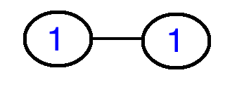

Therefore, the rolling median degree output is

	1.00

The second payment that arrives is in order and forms new edges in the graph.

	Jordan-Gruber <-> Jamie-Korn

	Maryann-Berry <-> Jamie-Korn

The graph now has three nodes and two edges

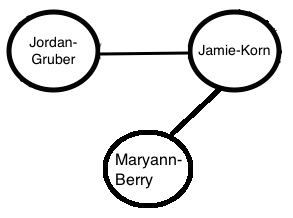

Median Degree of {1, 1, 2} = 1.00

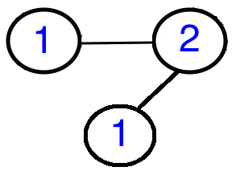

The rolling median degree output is

	1.00
	1.00

With the third payment coming in, these edges are formed:

	Jordan-Gruber <-> Jamie-Korn

	Maryann-Berry <-> Jamie-Korn

	Ying-Mo <-> Maryann-Berry

The graph now has four nodes and three edges:

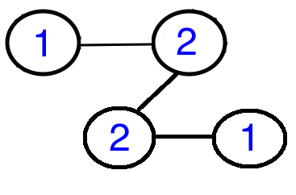

The degrees are {1, 1, 2, 2} and the median is the average of the two middle values, 1 and 2 -- or 1.50.

The rolling median degree output now becomes:

	1.00
	1.00
	1.50

The fourth payment that comes also is in order of time and forms new edges. The edges in the graph are:

	Jordan-Gruber <-> Jamie-Korn

	Maryann-Berry <-> Jamie-Korn

	Ying-Mo <-> Maryann-Berry

	Jamie-Korn <-> Ying-Mo

The fourth payment adds no new nodes but increases the edges, and therefore, degrees on some of the nodes.

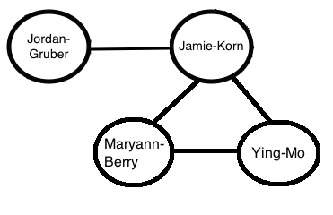

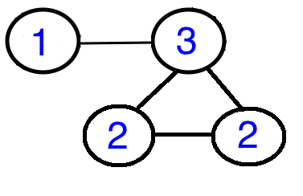

The set of degrees becomes {1, 2, 2, 3}, making the median 2.00

The rolling median degree output at the end of fourth payment is

	1.00
	1.00
	1.50
	2.00

Note that all the payments arrive in a timely order in this example, and for every incoming payment, all the old payments sit within the 60 second window from the timestamp of the latest incoming payment. Hence, no payments are evicted (we'll see an example below on how the edge eviction should be handled with time).

##Maintain data within the 60-second window
[Back to Table of Contents] (README.md#table-of-contents)

Now let's say that the next payment comes in and the extracted information is

	actor = Maryann-Berry, 	target = Maddie-Franklin, 	created_time: 2016-04-07T03:34:58Z

Extracted information from the five payments is

	actor = Jordan-Gruber, 	target = Jamie-Korn, 		created_time: 2016-04-07T03:33:19Z
	actor = Maryann-Berry, 	target = Jamie-Korn, 		created_time: 2016-04-07T03:33:19Z
	actor = Ying-Mo, 		target = Maryann Berry, 	created_time: 2016-04-07T03:33:19Z
	actor = Jamie-Korn, 	target = Ying-Mo, 			created_time: 2016-04-07T03:34:18Z
	actor = Maryann-Berry, 	target = Maddie-Franklin, 	created_time: 2016-04-07T03:34:58Z

We can see that the first three payments have a timestamp that is more than 60 seconds older than this new payment. This means that the edges formed by the three payments should be evicted and should not be included in our median degree calculation.

The revised information to be used in constructing the graph is as follows:

	actor = Jamie-Korn, 	target = Ying-Mo, 			created_time: 2016-04-07T03:34:18Z
	actor = Maryann-Berry, 	target = Maddie-Franklin, 	created_time: 2016-04-07T03:34:58Z

The edge list is now:

	Jamie-Korn <-> Ying-Mo

	Maryann-Berry <-> Maddie-Franklin

The graph has now changed to:

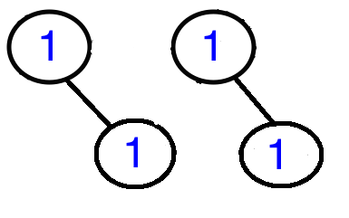

The rolling median degree, recalculated from {1, 1, 1, 1}, = 1.00

Normally, the median degree is calculated for a single graph, but maintaining multiple graphs for this problem can be quite difficult. For simplicity, we are only interested in calculating the median degree of all the nodes in all graphs despite them being disconnected.

The list of rolling median degrees now becomes:

	1.00
	1.00
	1.50
	2.00
	1.00

##Dealing with payments that arrive out of time
[Back to Table of Contents] (README.md#table-of-contents)

Payments that are out of order and fall within the 60 second window of the maximum timestamp processed, or in other words, are less than 60 seconds from the maximum timestamp being processed, will create new edges in the graph.

However, payments that are out of order in time and outside the 60-second window (or more than 60 seconds from the maximum timestamp being processed) should be ignored. Such payments won't contribute to building the graph. Below is a diagram showing this situation, with the nth payment corresponding the payment on the nth line of the `venmo-trans.txt` file.

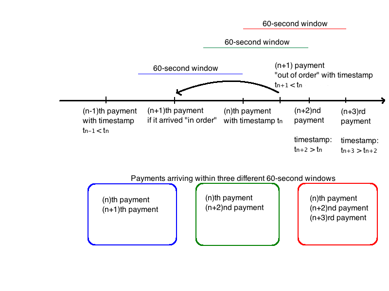

Continuing our example, another new payment comes in with the following extracted information:

	actor = Maryann-Berry, target = Ying-Mo, created_time: 2016-04-07T03:34:00Z

This payment is out of order but its timestamp still falls within the 60-second time window of the maximum timestamp that has been processed. (i.e., `2016-04-07T03:34:58Z`)

So the edge list is now

	actor = Jamie-Korn,    target = Ying-Mo, 		 created_time: 2016-04-07T03:34:18Z
	actor = Maryann-Berry, target = Maddie-Franklin, created_time: 2016-04-07T03:34:58Z
	actor = Maryann-Berry, target = Ying-Mo, 		 created_time: 2016-04-07T03:34:00Z

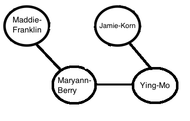

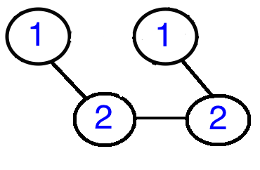

The median degree now calculated from {1, 1, 2, 2} = 1.50. The list of rolling median degrees becomes:

	1.00
	1.00
	1.50
	2.00
	1.00
	1.50

Another payment now arrives

	actor = Natalie-Piserchio, target = Rebecca-Waychunas, created_time: 2016-04-07T03:31:18Z

But this payment is out of order and its timestamp is outside of the maximum timestamp last processed (i.e., `2016-04-07T03:34:58Z`). This payment should be ignored. It will not form any new edges and will not contribute to the graph. The graph remains the same as before this payment arrived.

The rolling median is the same as before: {1, 1, 2, 2} = 1.50.

	1.00
	1.00
	1.50
	2.00
	1.00
	1.50
	1.50

Finally, another payment arrives with this information:

	actor = Nick-Shirreffs, target = Connor-Liebman, created_time: 2016-04-07T03:35:02Z

Because this payment now has the latest timestamp of `2016-04-07T03:35:02Z`, we must add it to our graph while pruning the nodes and edges that fall outside of the 60-second-window (i.e., edge between `Maryann-Berry` and `Ying-Mo` must be removed)

The payments now represented in the graph are:

	actor = Jamie-Korn, 	target = Ying-Mo, 		  created_time: 2016-04-07T03:34:18Z
	actor = Maryann-Berry,  target = Maddie-Franklin, created_time: 2016-04-07T03:34:58Z
	actor = Nick-Shirreffs, target = Connor-Liebman,  created_time: 2016-04-07T03:35:02Z

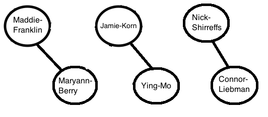

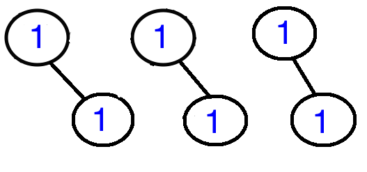

The new median degree, calculated from {1, 1, 1, 1, 1, 1} = 1.00 and our new list of rolling medians is

	1.00
	1.00
	1.50
	2.00
	1.00
	1.50
	1.50
	1.00

The output should be a file in the `venmo_output` directory named `output.txt` that contains the rolling median for each transaction in the file (e.g. if there are three input transactions, then there should be 3 medians), following the format above. The precision of the average should be two digits after the decimal place with truncation.

##Collecting payments from Venmo API

[Back to Table of Contents] (README.md#table-of-contents)

Ideally, the updates to the median degree of the graph would be connected to the Venmo streaming API and would add new payment to the end of `venmo-trans.txt`. However, connecting to the API has been discontinued for new users, and even if it were possible, would require more system specific "DevOps" work, which isn't the primary focus for data engineers.

Instead, you should simply assume that each new line of the text file corresponds to a new Venmo payment and design your program to handle a text file with a large number of payments. Your program should output the results to a text file named `output.txt` in the `venmo_output` directory.

##Writing clean, scalable and well-tested code
[Back to Table of Contents] (README.md#table-of-contents)

As a data engineer, it’s important that you write clean, well-documented code that scales for large amounts of data. For this reason, it’s important to ensure that your solution works well for a huge number of payments, rather than just the simple examples above.

For example, your solution should be able to account for a large number of payments coming in a short period of time, and need to keep up with the input (i.e. need to process a minute of payments in less than a minute).

It's also important to use software engineering best practices like **unit tests**, especially since public data is not clean and predictable. For more details about the implementation, please refer to the FAQ below or email us at <mailto:cc@insightdataengineering.com>

You may write your solution in any mainstream programming language such as C, C++, C#, Clojure, Erlang, Go, Haskell, Java, Python, Ruby, or Scala. Once completed, submit a link to a Github repo with your source code.

In addition to the source code, the top-most directory of your repo must include the `venmo_input` and `venmo_output` directories, and a shell script named `run.sh` that compiles and runs the program(s) that implement these features.

If your solution requires additional libraries, environments, or dependencies, you must specify these in your README documentation. See the figure below for the required structure of the top-most directory in your repo, or simply clone this repo.

##Repo directory structure
[Back to Table of Contents] (README.md#table-of-contents)

Example Repo Structure

	├── README.md
	├── run.sh
	├── src
	│  	└── median_degree.java
	├── venmo_input
	│   └── venmo-trans.txt
	├── venmo_output
	│   └── output.txt
	└── insight_testsuite
	 	   ├── run_tests.sh
		   └── tests
	        	└── test-1-venmo-trans
        		│   ├── venmo_input
        		│   │   └── venmo-trans.txt
        		│   └── venmo_output
        		│       └── output.txt
        		└── your-own-test
            		 ├── venmo_input
            		 │	  └── venmo-trans.txt
            		 └── venmo_output
            			  └── output.txt

The contents of `src` do not have to contain the single file called `"median_degree.java"`, you are free to include one or more files and name them as you wish.

##Testing your directory structure and output format
[Back to Table of Contents] (README.md#table-of-contents)

To make sure that your code has the correct directory structure and the format of the output data in `output.txt` is correct, we included a test script, called `run_tests.sh` in the `insight_testsuite` folder.

The tests are stored simply as text files under the `insight_testsuite/tests` folder. Each test should have a separate folder and in it should be a `venmo_input` folder for `venmo-trans.txt` and `venmo_output` folder for `output.txt` corresponding to the current test.

You can run the test with the following from the `insight_testsuite` folder:

	insight_testsuite$ ./run_tests.sh

The output of `run_tests.sh` should look like:

	[FAIL]: test-1-venmo-trans
	[Tue Mar 29 2016 11:59:59] 0 of 1 tests passed
	on failed tests and

	[PASS]: test-1-venmo-trans
	[Tue Mar 29 2016 11:59:59] 1 of 1 tests passed
	on success

One test has been provided as a way to check your formatting and simulate how we will be running tests when you submit your solution. We urge you to write your own additional tests here as well as for your own programming language. `run_tests.sh` should alert you if the directory structure is incorrect.

Your submission must pass at least the provided test in order to pass the coding challenge.

#FAQ

Here are some common questions we've received.  If you have additional questions, please email us at cc@insightdataengineering.com and we'll answer your questions as quickly as we can.

* *Which Github link should I submit?*  
You should submit the URL for the top-level root of your repository.  For example, this repo would be submitted by copying the URL `https://github.com/InsightDataScience/coding-challenge` into the appropriate field on the application.  Please do NOT try to submit your coding challenge using a pull request, which will make your source code publicly available.  

* *Do I need a private Github repo?*  
No, you may use a public repo, there is no need to purchase a private repo.  You may also submit a link to a Bitbucket repo if you prefer.

* *Do you have any larger sample inputs?*  
Yes, we have provided a sample of approximately 1,800 transactions in the `data-gen` directory of this repo.

* *May I use R or other analytics programming languages to solve the challenge?*  
While you may use any programming language to complete the challenge, it's important that your implementation scales to handle large amounts of data.  Many applicants have found that R is unable to process data in a scalable fashion, so it may be more practical to use another language.  

* *May I use distributed technologies like Hadoop or Spark?*  
While you're welcome to use any language or technology, it will be tested on a single machine so there may not be a significant benefit to using these technologies prior to the program.  With that said, learning about distributed systems is a valuable skill for all data engineers.

* *What sort of system should I use to run my program on (Windows, Linux, Mac)?*  
You may write your solution on any system, but your code should be portable and work on all systems.  In particular, your code must be able to run on either Unix or Linux, as that's the system that will be used for testing.  This means that you must submit a working `run.sh` script.  Linux machines are the industry standard for most data engineering teams, so it is helpful to be familiar with this.  If you're currently using Windows, we recommend using tools like Cygwin or Docker,  or a free online IDE such as Cloud9 (c9.io).  

* *Can I use pre-built packages, modules, or libraries?*   
This coding challenge can be completed without any "exotic" packages.  While you may use publicly available packages, modules, or libraries, you must document any dependencies in your accompanying `README` file.  When we review your submission, we will download these libraries and attempt to run your program.  If you do use a package, you should always ensure that the module you're using works efficiently for the specific use-case in the challenge, since many libraries are not designed for large amounts of data.

* *Will you email me if my code doesn't run?*   
Unfortunately, we receive hundreds of submissions in a very short time and are unable to email individuals if code doesn't compile or run.  This is why it's so important to document any dependencies you have, as described in the previous question.  We will do everything we can to properly test your code, but this requires good documentation.  More so, we have provided a test suite so you can confirm that your directory structure is correct.

* *Do I need to use multi-threading?*   
No, your solution doesn't necessarily need to include multi-threading - there are many solutions that don't require multiple threads/cores or any distributed systems, but instead use efficient data structures.  

* *Do I need to account for an updating `venmo-trans.txt` file?*   
No, your solution doesn't have to re-process `venmo-trans.txt`.  Instead, it should be designed to handle a very large input size.  If you were doing this project as a data engineer in industry, you would probably use a scheduler to run your program daily in batches, but this is beyond the scope of this challenge.  

* *What should the format of the output be?*  
In order to be tested correctly, you must use the format described above.  You can ensure that you have the correct format by using the testing suite we've included.  If you are still unable to get the correct format from the messages in the suite, please email us at cc@insightdataengineering.com.

* *What should the precision of the average be?*  
The precision of the average should be truncated to two digits after the decimal place (e.g. 5/3 should be outputted as 1.66).  

* *Do I need to update the median when the next payment in the file falls outside the 60-second window?*  
Yes, you're median should be updated each time a new payment is processed, regardless of if it falls outside the window.  Thus, if there are 500 lines in the input file then there should be 500 lines of median degree in `output.txt`.

* *Should the 60-second window be inclusive or exclusive?  In other words, for a 60-second window that ends with `01:02:30`, does it begin `01:01:30` or `01:01:31`?*  
The 60-second window should be exclusive.  In other words, a correct window of 60 seconds is from `01:01:31` to `01:02:30`.  Given that this nuance may be confusing, our testing suite is tolerant to exclusive or inclusive windows - both windows will be considered valid.  

* *Should my graph contain disconnected nodes?*                                       
No, the graph should only contain connected nodes, and this also means that you may need to remove nodes if they are no longer connected once payments are evicted from the 60-second window.  

* *Should I check if the files in the input directory are text files or non-text files(binary)?*  
No, for simplicity you may assume that all of the files in the input directory are standard text files, with the same format as described above.

* *If there are multiple payments within a 60-second window from the same two users, should they be connected twice?*  
No, please don't count multiple connections.  In other words, nodes can either be connected by one edge, or not connected at all.  However, you should ensure that the timestamp of the corresponding edge is properly updated.  

* *Can I use an IDE like Eclipse to write my program?*  
Yes, you can use what ever tools you want -  as long as your `run.sh` script correctly runs the relevant target files and creates the `output.txt` file in the `venmo_output` directory.

* *What should be in the `venmo_input` directory?*  
You can put any text file you want in the directory since our testing suite will replace it.  Indeed, using your own input files would be quite useful for testing.

* *How will the coding challenge be evaluated?*  
Generally, we will evaluate your coding challenge with a testing suite that provides a variety of inputs and checks the corresponding output.  This suite will attempt to use your `run.sh` and is fairly tolerant to different runtime environments.  Of course, there are many aspects (e.g. clean code, documentation) that cannot be tested by our suite, so each submission will also be reviewed manually by a person.

* *How long will it take for me to hear back from you about my submission?*  
We receive hundreds of submissions and try to evaluate them all in a timely manner.  We try to get back to all applicants within two or three weeks of submission, but if you have a specific deadline that requires expedited review, you may email us at cc@insightdataengineering.com.  
